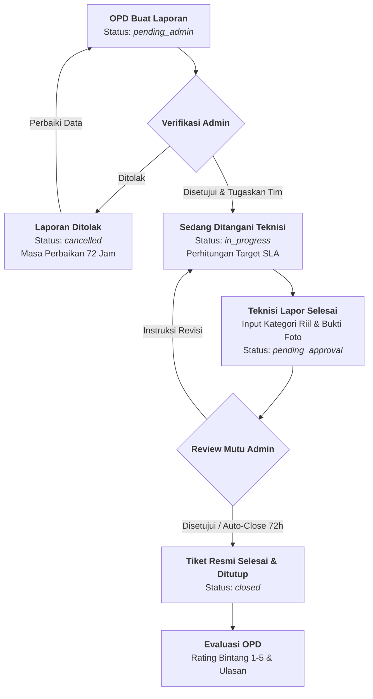

<p align="center">
  
</p>

<h1 align="center">Sistem Informasi Helpdesk Jaringan Intra Pemerintah</h1>

<p align="center">
  <strong>Dinas Komunikasi, Informatika, Persandian dan Statistik Kota Palu</strong>
</p>

<p align="center">
  <a href="#-fitur-utama"></a>
  <a href="#-fitur-utama"></a>
  <a href="#-fitur-utama"></a>
  <a href="#-fitur-utama"></a>
  <a href="#-fitur-utama"></a>
  <a href="#-pengujian-otomatis-automated-testing"></a>
</p>

---

## 📖 Tentang Aplikasi

**Sistem Helpdesk Diskominfo Kota Palu** adalah platform layanan terpadu yang dirancang untuk mengelola, memverifikasi, menugaskan tim teknisi, memonitor penanganan, dan merekapitulasi kendala infrastruktur jaringan teknologi informasi (*Fiber Optic*, *Local Area Network / LAN*, dan *WiFi*) bagi seluruh Organisasi Perangkat Daerah (OPD), Puskesmas, Kecamatan, dan Kelurahan di lingkungan Pemerintah Kota Palu.

---

## 🔄 Alur Siklus Hidup Tiket (*Ticket Lifecycle Workflow*)

Sistem menerapkan alur penanganan tiket berbasis kendali mutu Administrator (*Admin-Centric Workflow*):



---

## ✨ Fitur-Fitur Unggulan

### 1. 🏢 Organisasi Perangkat Daerah (Pelapor / OPD)
* **Pelaporan Mandiri Terstruktur**: Input deskripsi kendala, pemilihan jenis jaringan, detail lokasi gedung/ruangan, dan unggah lampiran foto kendala.
* **Isolasi Data Aman (*Tenant Isolation*)**: Pelapor OPD hanya dapat melihat dan mengelola tiket milik instansinya sendiri.
* **Pengajuan Ulang Laporan Ditolak (*Resubmit 72 Jam*)**: Hak perbaikan data laporan dalam batas 72 jam jika laporan ditolak admin.
* **Diskusi Publik Real-time**: Komunikasi tanya-jawab langsung dengan teknisi dan admin via WebSockets.
* **Evaluasi & Rating Layanan**: Pemberian nilai kepuasan bintang 1–5 serta ulasan setelah tiket resmi ditutup.

### 2. 👨‍🔧 Tim Teknisi Jaringan
* **Daftar Tugas Khusus**: Tampilan tiket yang ditugaskan ke teknisi (sebagai *Lead Technician* maupun *Secondary Technician*).
* **Catatan Internal Rahasia**: Kolom catatan teknis khusus internal (hanya bisa dibaca oleh teknisi dan admin, terisolasi dari OPD).
* **Lapor Penyelesaian & Kategori Riil**: Melaporkan solusi teknis, mengoreksi kategori gangguan riil hasil temuan lapangan, dan mengunggah foto bukti hasil kerja.
* **Tindak Lanjut Revisi**: Menerima instruksi perbaikan tambahan jika admin meminta penyempurnaan pekerjaan.

### 3. 👑 Administrator (Pusat Kendali Sistem)
* **Dashboard Eksekutif**: Metrik KPI lengkap, tingkat kepatuhan SLA (*On-Time vs Overdue*), distribusi gangguan per instansi & kategori, serta tren bulanan.
* **Pusat Master Data (*Master Data Hub*)**:
  - **Instansi / OPD**: Kelola data instansi, kode singkatan, alamat, dan proteksi hapus jika masih memiliki tiket aktif.
  - **Kategori Gangguan & SLA**: Konfigurasi batas target waktu penanganan (SLA dalam jam) berdasarkan jenis jaringan.
  - **Manajemen Pengguna**: Kelola akun pengguna, nomor WhatsApp kontak, penugasan role (*Admin, Teknisi, OPD User*), dan status aktif/nonaktif.
* **Laporan & Rekapitulasi Eksekutif**: Filter laporan multi-kriteria dan ekspor data ke format **PDF Formal** dan **Spreadsheet Excel**.
* **Otomatisasi Sistem (*Scheduler*)**: Command `tickets:auto-close` untuk menyetujui tiket otomatis jika telah berstatus *pending_approval* lebih dari 72 jam.

### 4. 📱 Notifikasi Otomatis Dual-Channel (WhatsApp & Email)
* **WhatsApp Gateway via Fonnte**: Terkirim otomatis menggunakan format resmi birokrasi pemerintahan tanpa jeda tunggu (*asynchronous background queue*).
* **Normalisasi Nomor Kontak (*PhoneNormalizer*)**: Otomatis menstandarkan format `08...`, `+628...` ke format internasional `628...`.
* **Email Formal HTML via Brevo SMTP**: Email berkop resmi Diskominfo Kota Palu dengan ringkasan tiket dan tombol tautan portal.
* **Pencatatan Riwayat (*Audit Trail*)**: Seluruh pengiriman WhatsApp dicatat statusnya (`success`/`failed`) dan respon payload API di tabel `whatsapp_notifications`.

---

## 🛠️ Tech Stack & Arsitektur

| Komponen | Teknologi |
| :--- | :--- |
| **Backend Framework** | Laravel 11.x (PHP 8.2+) |
| **Frontend Framework** | Vue.js 3 + TypeScript |
| **Single Page App Bridge** | Inertia.js |
| **Styling & UI Components** | Tailwind CSS 3 + shadcn-vue / Radix UI |
| **Database Engine** | MySQL / MariaDB |
| **Realtime WebSockets** | Laravel Reverb + Laravel Echo |
| **Notification Gateways** | Fonnte WhatsApp API Gateway & Brevo SMTP Relay |
| **Document Export** | DomPDF (PDF) & Maatwebsite Excel (XLSX) |
| **Automated Testing** | PHPUnit (67 Tests / 189 Assertions - 100% Green) |

---

## 🚀 Panduan Instalasi Lokal (Local Development)

### 1. Kloning Repositori
```bash
git clone https://github.com/PaluStudioCode/helpdesk-kominfo-palu.git
cd helpdesk-kominfo-palu
```

### 2. Instalasi Dependensi Backend & Frontend
```bash
composer install
npm install
```

### 3. Konfigurasi File Environment
Salin file template `.env.example` ke `.env` dan generate application key:
```bash
copy .env.example .env
php artisan key:generate
```

Sesuaikan konfigurasi database dan gateway di file `.env`:
```env
APP_NAME="Helpdesk Kominfo"
APP_ENV=local
APP_DEBUG=true
APP_URL=http://helpdesk-kominfo-palu.test

DB_CONNECTION=mysql
DB_HOST=127.0.0.1
DB_PORT=3306
DB_DATABASE=helpdesk_db
DB_USERNAME=root
DB_PASSWORD=""

# Gateway WhatsApp (Fonnte)
FONNTE_TOKEN=isi_token_fonnte_anda
FONNTE_URL=https://api.fonnte.com/send

# SMTP Email Relay (Brevo)
MAIL_MAILER=smtp
MAIL_HOST=smtp-relay.brevo.com
MAIL_PORT=587
MAIL_USERNAME=b1636a001@smtp-brevo.com
MAIL_PASSWORD=isi_password_smtp_anda
MAIL_ENCRYPTION=tls
MAIL_FROM_ADDRESS="palustudiocode@gmail.com"
MAIL_FROM_NAME="KominfoPalu"

# Realtime WebSockets
BROADCAST_CONNECTION=reverb
REVERB_HOST="localhost"
REVERB_PORT=8080
REVERB_SCHEME=http
```

### 4. Migrasi & Seeder Database
```bash
php artisan migrate:fresh --seed
```

### 5. Buat Symlink Storage & Kompilasi Aset
```bash
php artisan storage:link
npm run build
```

### 6. Menjalankan Server Lokal
Jalankan layanan berikut pada terminal terpisah:
```bash
# Terminal 1: Web Server
php artisan serve

# Terminal 2: WebSocket Reverb
php artisan reverb:start

# Terminal 3: Queue Worker (Pengiriman Notifikasi)
php artisan queue:listen

# Terminal 4 (Opsional): Vite Hot Reload
npm run dev
```

---

## 🔑 Kredensial Akun Bawaan (*Default Seed Accounts*)

| Role / Hak Akses | Email | Password | Keterangan |
| :--- | :--- | :--- | :--- |
| **Administrator** | `admin@kominfo.go.id` | `password` | Akses penuh ke seluruh fitur dan Master Data |
| **Teknisi (Lead)** | `ahmad.teknisi@palukota.go.id` | `password` | Penanganan tiket & catatan teknis |
| **Teknisi** | `budi.teknisi@palukota.go.id` | `password` | Anggota tim teknisi |
| **Operator OPD** | `operator@dinkes.palukota.go.id` | `password` | Akun Dinas Kesehatan Kota Palu |
| **Operator OPD** | `operator@disdik.palukota.go.id` | `password` | Akun Dinas Pendidikan Kota Palu |

---

## 🧪 Pengujian Otomatis (*Automated Testing*)

Seluruh modul aplikasi telah dilengkapi dengan pengujian otomatis (*Unit, Feature, Service, Security, & Notification Tests*):

```bash
# Menjalankan seluruh pengujian otomatis
php artisan test

# Menjalankan pengujian spesifik sistem notifikasi
php artisan test --filter=NotificationTest

# Menjalankan pengujian siklus hidup tiket
php artisan test --filter=TicketLifecycleTest
```

### Command Pengujian Live Mandiri:
```bash
# Uji coba kirim WhatsApp live ke nomor tujuan
php artisan whatsapp:test 082195466654

# Uji coba kirim Email HTML live ke email tujuan
php artisan mail:test namaanda@gmail.com
```

---

## 📂 Struktur Direktori Utama

```text
helpdesk-kominfo-palu/
├── app/
│   ├── Console/Commands/       # Command tickets:auto-close, whatsapp:test, mail:test
│   ├── Http/Controllers/       # Controller (Dashboard, Ticket, MasterData, Action, Report)
│   ├── Jobs/                   # SendTicketNotificationJob (Queue)
│   ├── Mail/                   # TicketNotificationMail (HTML Mailable)
│   ├── Models/                 # Ticket, Department, User, TicketCategory, WhatsappNotification
│   ├── Policies/               # TicketPolicy, UserPolicy, DepartmentPolicy, CategoryPolicy
│   └── Services/               # DashboardService, TicketService, FonnteService, NotificationDispatcher
├── database/
│   ├── migrations/             # Struktur skema tabel database
│   └── seeders/                # Seeder akun, master OPD, kategori SLA, & tiket sampel
├── resources/
│   ├── js/
│   │   ├── Components/         # Komponen reusable (DataTable, FileUpload, StatusBadge, UI)
│   │   ├── Layouts/            # AuthenticatedLayout, GuestLayout
│   │   └── Pages/              # Dashboard, Tickets (Index, Show, Create), Admin Master Data, Reports
│   └── views/
│       ├── app.blade.php       # Single-page template root
│       └── emails/             # Template email HTML resmi
├── routes/
│   ├── web.php                 # Route aplikasi & aksi tiket
│   └── channels.php            # Otorisasi private WebSocket channels
└── tests/
    ├── Feature/                # Feature tests (Auth, Lifecycle, Security, Discussion, Notification)
    └── Unit/                   # Unit tests (Models, Services, Events)
```

---

## 📄 Lisensi & Hak Cipta

Aplikasi ini dikembangkan untuk kepentingan operasional **Dinas Komunikasi, Informatika, Persandian dan Statistik Pemerintah Kota Palu**. Seluruh hak cipta dilindungi undang-undang.
