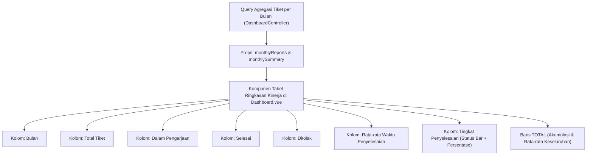

# Rencana Implementasi: Komponen Ringkasan Kinerja & Tingkat Penyelesaian Bulanan (Dashboard Admin)

Dokumen ini memuat rencana pembuatan komponen tabel **Ringkasan Laporan & Kinerja Bulanan** pada halaman **Dashboard Admin (`/dashboard`)** mengacu pada format `agents/contoh.md`.

---

## 1. Deskripsi Fitur & Kebutuhan

Komponen ini berfungsi untuk menampilkan rekapitulasi data tiket per bulan secara berkala, mencakup volume tiket, distribusi status, efisiensi durasi penanganan, dan visualisasi **Status Bar Tingkat Penyelesaian**.



---

## 2. Struktur Kolom Tabel yang Diusulkan

| No | Nama Kolom | Deskripsi Data | Format Tampilan | Rata Teks |
| :-: | :--- | :--- | :--- | :-: |
| 1 | **Bulan / Periode** | Bulan dan tahun pembuatan tiket | Contoh: `Januari 2025`, `Februari 2025` | Kiri |
| 2 | **Total Tiket** | Total tiket yang masuk pada bulan tersebut | Angka tebal (contoh: `19`) | Kanan / Tengah |
| 3 | **Dalam Pengerjaan** | Tiket status `in_progress` + `pending_approval` | Badge/Warna Amber (contoh: `3`) | Kanan / Tengah |
| 4 | **Selesai** | Tiket status `closed` | Badge/Warna Emerald (contoh: `16`) | Kanan / Tengah |
| 5 | **Ditolak** | Tiket status `cancelled` | Badge/Warna Rose (contoh: `2`) | Kanan / Tengah |
| 6 | **Rata-rata Waktu Penyelesaian** | Rata-rata durasi `closed_at - created_at` tiket selesai | Teks format: `5 jam 38 menit` | Kanan / Tengah |
| 7 | **Tingkat Penyelesaian** | Persentase `(Selesai / Total) * 100%` + Visual Bar | **Status Bar Visual** + Teks `84.21%` | Kiri / Fleksibel |

### Desain Visual Kolom "Tingkat Penyelesaian" (Status Bar)
- **Visual Bar**: Bar horizontal rounded dengan warna dinamis sesuai capaian:
  - 🟢 **Emerald (Hijau)**: Nilai >= 75%
  - 🟡 **Amber (Kuning)**: Nilai 50% - 74.9%
  - 🔴 **Rose (Merah)**: Nilai < 50%
- **Teks Persentase**: Ditampilkan di samping status bar dengan font monospaced/semi-bold (contoh: `84.21%`).

### Baris Footer (`TOTAL`)
Baris penutup tabel yang menghitung:
- **Total Keseluruhan**: Total seluruh tiket tahun 2025 (260+).
- **Total Dalam Pengerjaan, Selesai, dan Ditolak**.
- **Rata-rata Waktu Penyelesaian Keseluruhan** (contoh: `5 jam 55 menit`).
- **Tingkat Penyelesaian Keseluruhan** (contoh: `76.54%` dengan status bar terpadu).

---

## 3. Rincian Perubahan Kode

### A. Backend Controller (`app/Http/Controllers/DashboardController.php`)
Menambahkan kalkulasi agregasi bulanan untuk role `admin`:
- Menghitung per bulan: `total_tickets`, `in_progress`, `closed`, `cancelled`, `avg_resolution_time`, dan `completion_rate`.
- Menghitung baris ringkasan `monthlySummary`.
- Mengirimkan props ke Inertia view.

### B. Frontend Component (`resources/js/Pages/Dashboard.vue`)
Menambahkan komponen card tabel di bawah "Distribusi Infrastruktur Gangguan" untuk role `admin`:
- Card dengan Header: **"Ringkasan Kinerja & Tingkat Penyelesaian Bulanan"**.
- Menggunakan komponen `Table`, `TableHeader`, `TableBody`, `TableFooter`, `TableRow`, `TableHead`, `TableCell`.
- Visual status bar responsif dengan animasi transisi halus.

### C. Automated Test (`tests/Feature/DashboardTest.php`)
Memastikan props `monthlyReports` dan `monthlySummary` teruji pada `test_admin_dashboard_metrics`.

---

## 4. Rencana Verifikasi

1. Menjalankan PHPUnit test:
   ```bash
   php artisan test --filter=DashboardTest
   ```
2. Menjalankan Vite build:
   ```bash
   npm run build
   ```
3. Verifikasi tampilan di dashboard Admin: Memastikan data tabel dari Januari s.d. Desember 2025 tampil lengkap dengan status bar persentase yang interaktif.
